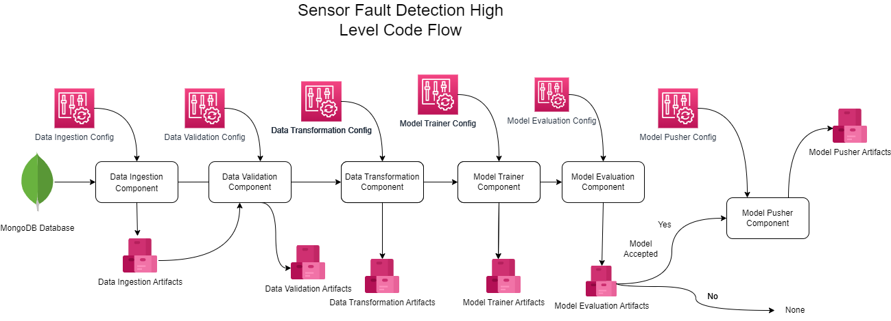
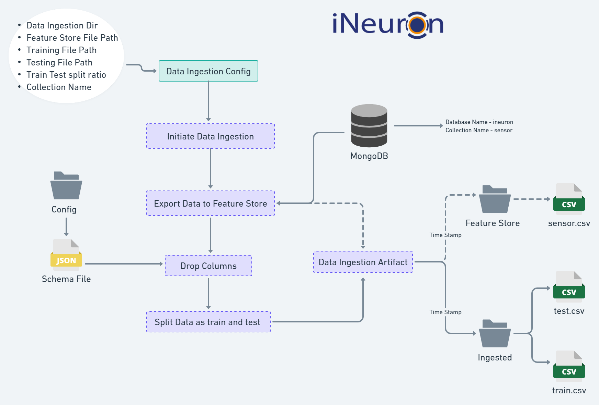
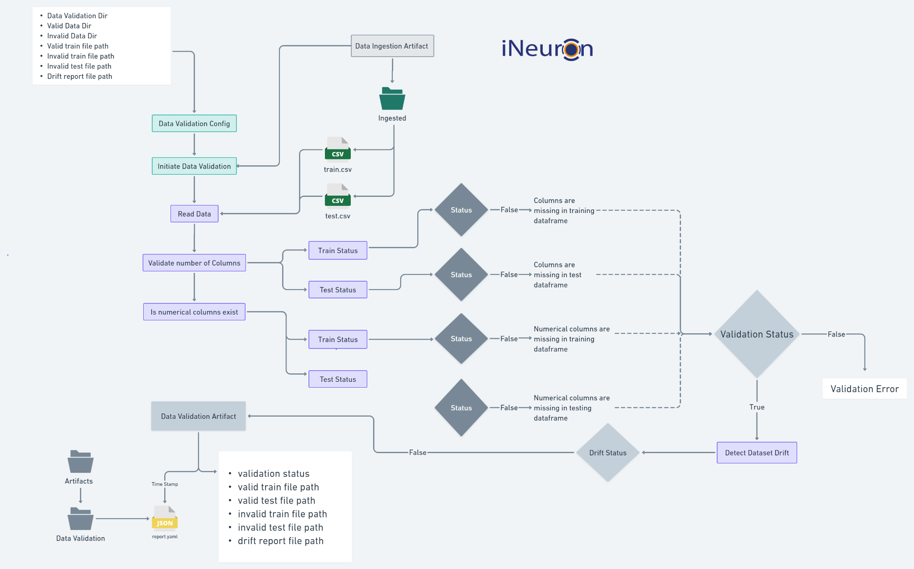
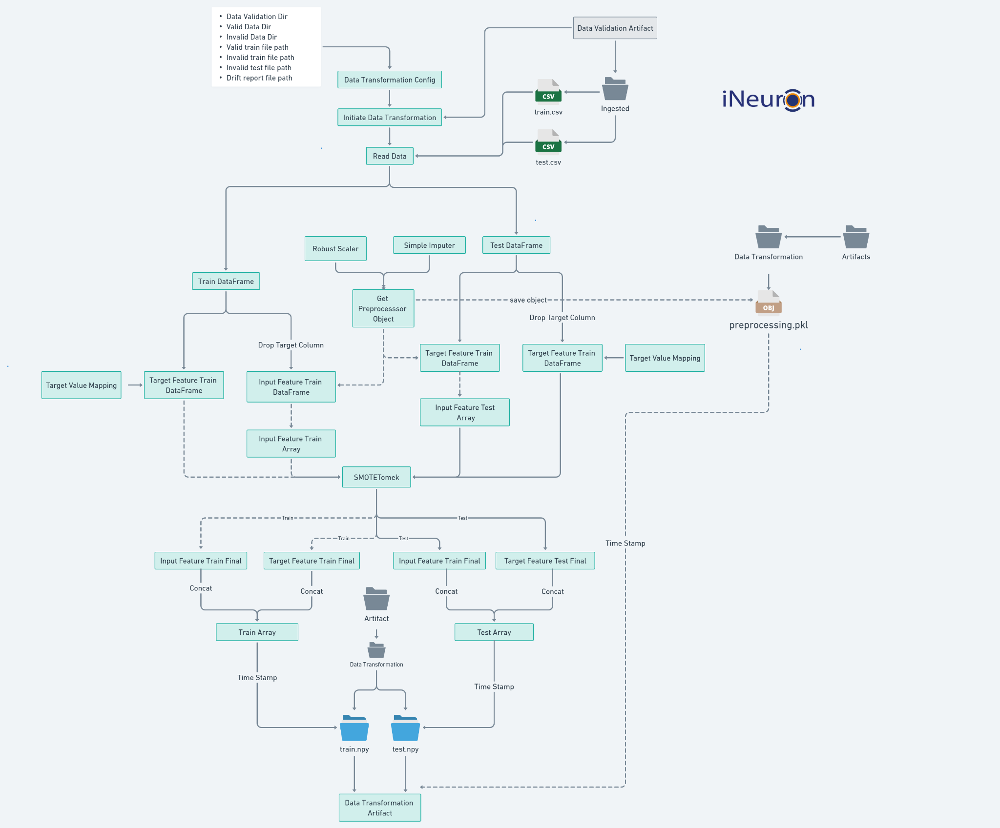
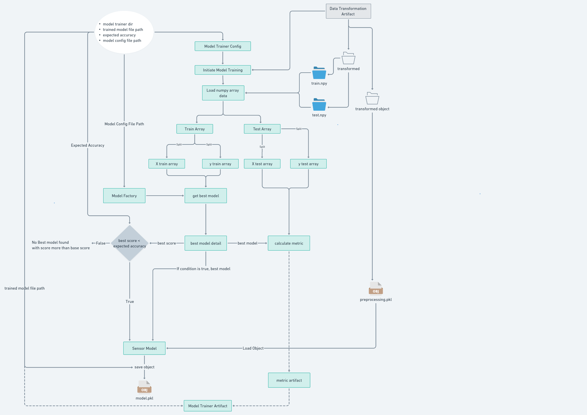
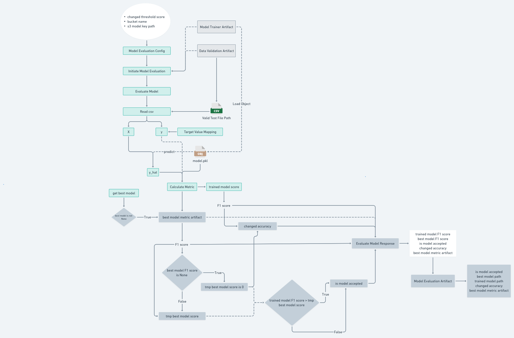
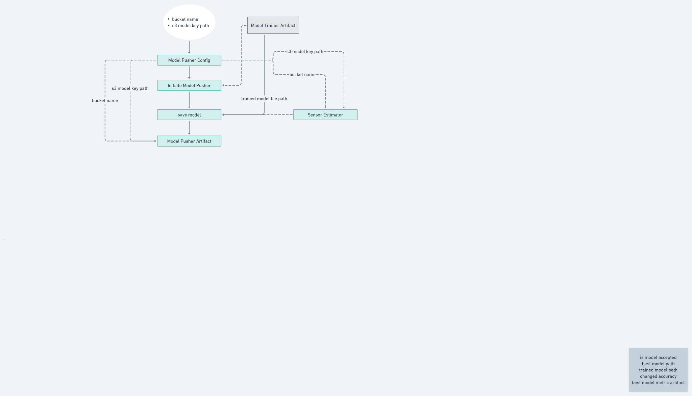
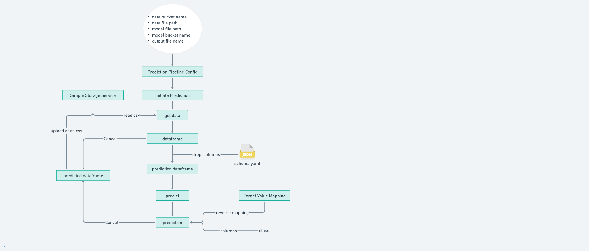

<div align="center">

# ⚙️ SensorLive AI

### Industrial Sensor Fault Detection • End-to-End Machine Learning • MLOps

<p>
  <b>A production-oriented machine learning pipeline for detecting sensor-system failures from industrial telemetry data.</b>
</p>

<p>
  <a href="https://github.com/zainulabedeen589/SENSORLIVE">
    
  </a>
  
  
  
  
</p>

<p>
  <a href="#-overview">Overview</a> •
  <a href="#-architecture">Architecture</a> •
  <a href="#-ml-pipeline">ML Pipeline</a> •
  <a href="#-prediction-flow">Prediction</a> •
  <a href="#-project-structure">Structure</a> •
  <a href="#-setup">Setup</a>
</p>

</div>

---

## 🧠 Overview

**SensorLive AI** is an end-to-end **sensor fault detection** system designed around a modular ML/MLOps architecture.

Instead of treating model training as a single notebook, the project separates the lifecycle into independently testable components:

```text
DATA INGESTION
      ↓
DATA VALIDATION
      ↓
DATA TRANSFORMATION
      ↓
MODEL TRAINING
      ↓
MODEL EVALUATION
      ↓
MODEL PUSHING
      ↓
PREDICTION
```

The architecture is built to make the workflow reproducible, configurable and easier to maintain as the project evolves from experimentation toward deployment.

### 🎯 Core Objective

Given industrial sensor measurements, the system learns patterns associated with machine/sensor failure and produces a classification prediction for new observations.

---

## ✨ What Makes This Project Different?

| Capability | Implementation |
|---|---|
| 📥 Data ingestion | MongoDB-based data ingestion and artifact generation |
| ✅ Data validation | Schema/column validation and dataset-quality checks |
| 🔄 Data transformation | Imputation, scaling, target mapping and feature preparation |
| 🧠 Model training | Model factory + train/test evaluation workflow |
| 📊 Model evaluation | Metric calculation and best-model comparison |
| 📦 Model artifact | Serialized trained model + preprocessing object |
| ☁️ Model pushing | Accepted model can be pushed to configured storage |
| 🔮 Prediction | Batch prediction pipeline with feature alignment |
| 🧩 Modular architecture | Config → Component → Artifact pattern |
| 🛠️ Reproducibility | Timestamped artifacts and explicit pipeline stages |

---

# 🏗️ Architecture

## 1. High-Level Training Pipeline

The complete training lifecycle connects each ML component through artifacts:

```text
┌──────────────────┐
│ Data Ingestion   │
└────────┬─────────┘
         ↓
┌──────────────────┐
│ Data Validation  │
└────────┬─────────┘
         ↓
┌──────────────────┐
│ Data Transform   │
└────────┬─────────┘
         ↓
┌──────────────────┐
│ Model Training   │
└────────┬─────────┘
         ↓
┌──────────────────┐
│ Model Evaluation │
└────────┬─────────┘
         ↓
   ┌───────────────┐
   │ Model Accepted│
   └───────┬───────┘
           ↓
┌──────────────────┐
│ Model Pusher     │
└──────────────────┘
```

### Architecture Diagram



---

# 📥 Data Ingestion

The ingestion layer is responsible for bringing sensor data into the ML pipeline.

### Flow

```text
Configuration
     ↓
Data Ingestion
     ↓
MongoDB
     ↓
Export to Feature Store
     ↓
Drop Unnecessary Columns
     ↓
Train / Test Split
     ↓
Data Ingestion Artifact
```

The project uses **MongoDB** as the data source and generates timestamped artifacts for downstream components.



### Data source

```text
Database  : ineuron
Collection: sensor
```

> Credentials and connection strings should be supplied through environment variables. Never commit secrets to GitHub.

---

# 🔍 Data Validation

Before training, the validation layer checks whether the incoming datasets satisfy the expected structure.

### Validation responsibilities

- Validate expected number of columns
- Verify required columns exist
- Validate numerical feature availability
- Validate train/test structure
- Generate validation status
- Detect dataset drift
- Produce a validation report artifact

```text
                  ┌──────────────┐
                  │  Read Data   │
                  └──────┬───────┘
                         ↓
              ┌─────────────────────┐
              │ Validate Structure  │
              └──────────┬──────────┘
                         ↓
              ┌─────────────────────┐
              │ Validate Features   │
              └──────────┬──────────┘
                         ↓
                  ┌─────────────┐
                  │ Drift Check │
                  └──────┬──────┘
                         ↓
                Validation Status
```



---

# 🔄 Data Transformation

The transformation layer converts validated raw data into model-ready features.

### Transformation flow

```text
Validated Data
      ↓
Train / Test DataFrame
      ↓
Target Mapping
      ↓
Drop Target Column
      ↓
Missing Value Imputation
      ↓
Feature Scaling
      ↓
SMOTE / Class-Balance Processing
      ↓
Train / Test Arrays
      ↓
Transformation Artifacts
```

### Key processing blocks

- **SimpleImputer** for missing values
- **RobustScaler** for feature scaling
- **SMOTE** for class-imbalance handling
- Target-value mapping
- Feature/target separation
- Serialized preprocessing object



---

# 🧠 Model Training

The model-training component receives transformed arrays and performs model selection.

### Training flow

```text
Transformed Train Array
          ↓
    X_train / y_train
          ↓
     Model Factory
          ↓
     Candidate Models
          ↓
       Training
          ↓
    Metric Calculation
          ↓
   Best Model Selection
          ↓
   Model Trainer Artifact
```

The **Model Factory** provides a centralized location for managing candidate estimators and their training workflow.

The selected model must satisfy the configured performance requirement before it can proceed through the remaining pipeline.



---

# 📊 Model Evaluation

Training performance alone is not enough. The evaluation component compares the trained model against the best available model and applies an acceptance condition.

### Evaluation flow

```text
Validation/Test Dataset
          ↓
       Load Model
          ↓
        Predict
          ↓
   Calculate Metric
          ↓
 Compare with Best Model
          ↓
 ┌──────────────────────┐
 │ Is trained model     │
 │ better than baseline?│
 └──────────┬───────────┘
            │
       ┌────┴────┐
      YES        NO
       ↓          ↓
   Accepted     Rejected
```

The evaluation artifact records information required for the next stage of the pipeline.



---

# ☁️ Model Pusher

Only an accepted model is eligible for model pushing.

The model-pusher component takes the trained model artifact and transfers the selected model to the configured model-storage location.

```text
Model Trainer Artifact
          ↓
     Trained Model
          ↓
    Model Pusher
          ↓
 Configured Storage
```

### Model-pusher configuration

Typical configuration includes:

- Bucket name
- Model key/path
- Trained model file path
- Model artifact metadata



---

# 🔮 Prediction Pipeline

The prediction pipeline is intentionally separated from model training.

### Prediction flow

```text
Prediction Configuration
          ↓
     Initiate Prediction
          ↓
        Get Data
          ↓
       DataFrame
          ↓
   Remove Unused Columns
          ↓
  Prediction DataFrame
          ↓
        Predict
          ↓
 Target Value Reverse Mapping
          ↓
      Predictions
          ↓
   Output CSV / Artifact
```

The prediction layer loads the required model/preprocessing artifacts, aligns the incoming features with the training schema and converts model output back to the target representation.



---

# 🔁 End-to-End MLOps Lifecycle

```text
                    ┌─────────────────────┐
                    │      MongoDB        │
                    │   Sensor Dataset    │
                    └──────────┬──────────┘
                               ↓
                    ┌─────────────────────┐
                    │   DATA INGESTION    │
                    └──────────┬──────────┘
                               ↓
                    ┌─────────────────────┐
                    │   DATA VALIDATION   │
                    └──────────┬──────────┘
                               ↓
                    ┌─────────────────────┐
                    │ DATA TRANSFORMATION │
                    └──────────┬──────────┘
                               ↓
                    ┌─────────────────────┐
                    │   MODEL TRAINING    │
                    └──────────┬──────────┘
                               ↓
                    ┌─────────────────────┐
                    │  MODEL EVALUATION   │
                    └──────────┬──────────┘
                               ↓
                      ┌────────────────┐
                      │ Model Accepted?│
                      └───────┬────────┘
                         YES  │
                              ↓
                    ┌─────────────────────┐
                    │    MODEL PUSHER     │
                    └──────────┬──────────┘
                               ↓
                    ┌─────────────────────┐
                    │  PREDICTION LAYER  │
                    └─────────────────────┘
```

---

# 🧩 Component Architecture

Each pipeline stage follows a consistent separation between **configuration**, **execution**, and **artifacts**.

```text
                 ┌──────────────────────┐
                 │      Config          │
                 │ YAML / JSON / Env    │
                 └──────────┬───────────┘
                            ↓
                 ┌──────────────────────┐
                 │     Component        │
                 │   Business Logic     │
                 └──────────┬───────────┘
                            ↓
                 ┌──────────────────────┐
                 │      Artifact        │
                 │  Output + Metadata   │
                 └──────────────────────┘
```

This separation helps keep the pipeline modular and makes individual stages easier to test and replace.

---

# 🛠️ Technology Stack

### Programming

- Python
- Object-Oriented Programming
- Modular package architecture
- Exception handling
- Logging
- Dataclasses / configuration objects

### Data & ML

- Pandas
- NumPy
- Scikit-learn
- SimpleImputer
- RobustScaler
- SMOTE
- Model Factory pattern

### Database

- MongoDB
- PyMongo

### MLOps / Engineering

- Pipeline artifacts
- Model serialization
- Configuration-driven components
- Validation reports
- Model evaluation
- Model pushing
- Batch prediction

### Application Layer

- Streamlit
- Plotly
- Prediction workbench
- Dataset exploration
- Model information
- Analytics

---

# 📁 Project Structure

A recommended structure for the project is:

```text
SENSORLIVE/
│
├── sensor/
│   ├── components/
│   │   ├── data_ingestion.py
│   │   ├── data_validation.py
│   │   ├── data_transformation.py
│   │   ├── model_trainer.py
│   │   ├── model_evaluation.py
│   │   └── model_pusher.py
│   │
│   ├── config/
│   │   └── configuration.py
│   │
│   ├── entity/
│   │   ├── config_entity.py
│   │   └── artifact_entity.py
│   │
│   ├── constants/
│   │   └── __init__.py
│   │
│   ├── exception/
│   │   └── exception.py
│   │
│   ├── logger/
│   │   └── logger.py
│   │
│   ├── utils/
│   │   └── main_utils.py
│   │
│   └── __init__.py
│
├── config/
│   └── schema.yaml
│
├── artifact/
│   └── <timestamped-artifacts>/
│
├── notebooks/
│   └── ...
│
├── app/
│   └── ...
│
├── main.py
├── requirements.txt
├── setup.py
├── .env
├── .gitignore
└── README.md
```

> Keep secrets such as MongoDB connection strings in `.env` and exclude the file using `.gitignore`.

---

# ⚙️ Configuration

The pipeline is designed around external configuration rather than hard-coding values inside individual components.

Typical configuration categories include:

```text
Data Ingestion
├── Data ingestion directory
├── Feature store path
├── Training file path
├── Testing file path
├── Train/test split ratio
└── MongoDB collection

Data Validation
├── Validation directory
├── Valid data directory
├── Invalid data directory
├── Train/test file paths
└── Drift report path

Data Transformation
├── Transformation artifact directory
├── Preprocessor path
├── Train array path
└── Test array path

Model Training
├── Model trainer directory
├── Expected accuracy / threshold
├── Trained model path
└── Model configuration

Model Evaluation
├── Evaluation threshold
├── Model bucket
└── Model key/path

Model Pusher
├── Bucket name
└── Model key/path
```

---

# 🔐 Environment Variables

Create a local `.env` file for secrets and deployment-specific configuration.

Example:

```env
MONGODB_URL=<your-mongodb-connection-string>
```

Do **not** commit:

```text
.env
credentials
API keys
private certificates
cloud access keys
```

---

# 🚀 Setup

## 1. Clone the repository

```bash
git clone https://github.com/zainulabedeen589/SENSORLIVE.git
cd SENSORLIVE
```

## 2. Create a virtual environment

### macOS / Linux

```bash
python3 -m venv venv
source venv/bin/activate
```

### Windows

```bash
python -m venv venv
venv\Scripts\activate
```

## 3. Install dependencies

```bash
pip install -r requirements.txt
```

## 4. Configure environment variables

Create `.env` and add the required MongoDB connection string.

## 5. Run the pipeline

Use the project's configured entry point:

```bash
python main.py
```

For the interactive application, launch the Streamlit entry file used by your current project configuration, for example:

```bash
streamlit run app.py
```

---

# 📈 ML Workflow

The project follows a clear separation of responsibilities:

```text
Raw Sensor Data
      │
      ▼
┌───────────────┐
│ Data Ingestion│
└───────┬───────┘
        ▼
┌────────────────┐
│ Data Validation│
└───────┬────────┘
        ▼
┌───────────────────┐
│ Data Transformation│
└─────────┬─────────┘
          ▼
┌────────────────┐
│ Model Training │
└───────┬────────┘
        ▼
┌─────────────────┐
│ Model Evaluation│
└───────┬─────────┘
        │
   ┌────┴────┐
   │         │
 ACCEPT    REJECT
   │         │
   ▼         ▼
 PUSH       STOP
   │
   ▼
PREDICTION
```

---

# 🧪 Data & Feature Processing

The transformation stage prepares sensor observations for machine learning by handling common production-data problems:

### Missing values

```text
Raw Features
     ↓
SimpleImputer
     ↓
Complete Feature Matrix
```

### Scaling

```text
Feature Matrix
     ↓
RobustScaler
     ↓
Scaled Features
```

### Class imbalance

```text
Training Data
     ↓
SMOTE
     ↓
Balanced Training Representation
```

### Target encoding

```text
Original Target
     ↓
Target Value Mapping
     ↓
Numeric Model Target
     ↓
Model Prediction
     ↓
Reverse Mapping
     ↓
Original Target Representation
```

---

# 📦 Artifacts

Each major component produces artifacts that become inputs for later pipeline stages.

```text
artifact/
└── <timestamp>/
    │
    ├── data_ingestion/
    ├── data_validation/
    │   └── report.yaml
    │
    ├── data_transformation/
    │   ├── train.npy
    │   ├── test.npy
    │   └── preprocessing.pkl
    │
    ├── model_trainer/
    │   └── model.pkl
    │
    ├── model_evaluation/
    │   └── evaluation artifact
    │
    └── model_pusher/
        └── pushed model
```

The exact artifact names/directories can vary according to the active configuration.

---

# 🔮 Prediction Design

The prediction pipeline is designed around a simple principle:

> **Training-time preprocessing and prediction-time preprocessing must remain consistent.**

```text
Incoming CSV
     ↓
Feature Selection
     ↓
Feature Alignment
     ↓
Saved Preprocessor
     ↓
Saved Model
     ↓
Prediction
     ↓
Reverse Target Mapping
     ↓
Prediction Output
```

This avoids treating the prediction layer as an isolated script and keeps it connected to the same feature-processing contract used during training.

---

# 🎯 Engineering Goals

This project demonstrates practical ML engineering concepts beyond model fitting:

- Modular ML pipeline design
- Configuration-driven development
- Data validation
- Data drift detection
- Reusable preprocessing
- Class-imbalance handling
- Model selection
- Model acceptance logic
- Artifact-based pipeline communication
- Model serialization
- Cloud/model storage abstraction
- Batch prediction
- Exception handling
- Logging
- Reproducibility

---

# 🧭 Future Improvements

Potential production extensions include:

- [ ] CI/CD automation
- [ ] Dockerized training and inference
- [ ] MLflow experiment tracking
- [ ] Automated model registry
- [ ] Scheduled retraining
- [ ] Production model monitoring
- [ ] Feature drift dashboards
- [ ] Prediction drift monitoring
- [ ] REST inference service
- [ ] Cloud deployment
- [ ] Automated rollback
- [ ] Model explainability
- [ ] Automated data-quality alerts

---

# 📊 Architecture Gallery

### Data Ingestion


### Data Validation


### Data Transformation


### Model Training


### Model Evaluation


### Model Pusher


### Prediction Pipeline


---

# 👨‍💻 Author

<div align="center">

### Zainul Abedeen

**Data Scientist • Machine Learning • MLOps**

[GitHub](https://github.com/zainulabedeen589) •
[LinkedIn](https://www.linkedin.com/in/zainulabedeen589/) •
[Portfolio](https://zainulabedeen589.netlify.app/)

</div>

---

# ⭐ Support

If you find this project useful, consider giving the repository a ⭐ on GitHub.

<div align="center">

**Built with Python, Machine Learning & MLOps**

</div>
